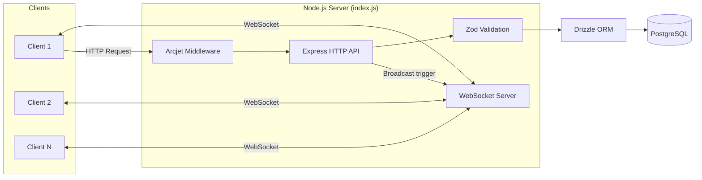
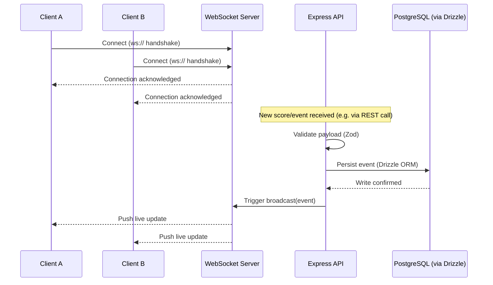
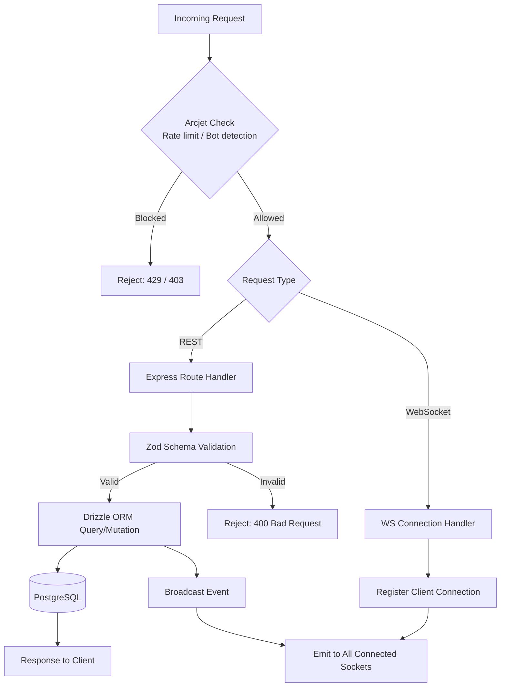
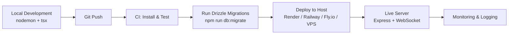

# LiveScore ⚡

A real-time WebSocket demo project that pushes live score/event updates to connected clients using Node.js, Express, and native WebSockets.

> This project demonstrates how WebSockets can be used to broadcast real-time events (e.g. live scores) to multiple clients with low latency, backed by a PostgreSQL database via Drizzle ORM.

---

## Table of Contents

- [Tech Stack](#tech-stack)
- [Features](#features)
- [Project Structure](#project-structure)
- [Architecture & Flow Diagrams](#architecture--flow-diagrams)
- [SDLC Overview](#sdlc-overview)
  - [1. Requirement Analysis](#1-requirement-analysis)
  - [2. System Design](#2-system-design)
  - [3. Implementation](#3-implementation)
  - [4. Testing](#4-testing)
  - [5. Deployment](#5-deployment)
  - [6. Maintenance](#6-maintenance)
- [Getting Started](#getting-started)
- [Environment Variables](#environment-variables)
- [Database Migrations](#database-migrations)
- [Available Scripts](#available-scripts)
- [Contributing](#contributing)
- [License](#license)

---

## Tech Stack

| Layer | Technology |
|---|---|
| Runtime | Node.js (ESM) |
| Web Framework | Express 5 |
| Real-time Layer | WebSocket (`ws`) |
| Database | PostgreSQL |
| ORM | Drizzle ORM (+ Drizzle Kit for migrations) |
| Validation | Zod |
| Security / Rate Limiting | Arcjet (`@arcjet/node`, `@arcjet/inspect`) |
| Config | dotenv |
| Dev Tooling | nodemon, tsx, TypeScript type defs |

## Features

- Real-time event broadcasting over WebSockets
- REST endpoints via Express for standard request/response operations
- Schema-driven PostgreSQL access using Drizzle ORM
- Request validation using Zod schemas
- Bot/abuse protection and rate limiting via Arcjet
- Environment-based configuration

## Project Structure

```
livescore/
├── drizzle/          # Drizzle ORM migrations & schema metadata
├── src/               # Application source code (routes, sockets, db, services)
├── index.js           # Application entry point
├── drizzle.config.js  # Drizzle Kit configuration
├── package.json
└── .gitignore
```

---

## Architecture & Flow Diagrams

### High-Level Architecture



### Real-Time Broadcast Sequence



### Request Handling & Data Flow



### Deployment Flow



---

## SDLC Overview

This section documents the Software Development Life Cycle followed (or recommended) for building and evolving this project.

### 1. Requirement Analysis

**Goal:** Demonstrate real-time delivery of live event/score updates to multiple connected clients.

- **Functional requirements**
  - Clients can connect to the server via a WebSocket connection.
  - Server can broadcast score/event updates to all connected clients in real time.
  - Server exposes REST endpoints (via Express) for auxiliary operations (e.g. fetching historical data, health checks).
  - Data is persisted in PostgreSQL and accessed through Drizzle ORM.
  - Incoming requests are validated using Zod schemas.
  - Basic protection against abusive/bot traffic via Arcjet.
- **Non-functional requirements**
  - Low-latency message delivery (near real-time).
  - Horizontal scalability of WebSocket connections (future consideration).
  - Maintainable, typed data access layer.
- **Stakeholders:** Project author/maintainer, contributors, end clients consuming the live feed.

### 2. System Design

- **Architecture:** Single Node.js process running an Express HTTP server with an attached WebSocket server, sharing the same port/process.
- **Data flow:**
  1. An event/score update is generated (manually triggered, via API call, or external source).
  2. The update is validated (Zod) and optionally persisted to PostgreSQL (Drizzle ORM).
  3. The server broadcasts the update to all open WebSocket connections.
  4. Connected clients receive and render the update instantly.
- **Database design:** Managed through Drizzle schema files, with versioned migrations stored in `drizzle/`.
- **Security design:** Arcjet middleware inspects incoming traffic for rate-limit violations and bot behavior before requests reach business logic.

> Suggested diagram (add to `/docs` or embed here):
> `Client (WS) <--> WebSocket Server <--> Express API <--> Drizzle ORM <--> PostgreSQL`

### 3. Implementation

- Core server bootstrap lives in `index.js`.
- Business logic, routes, and socket handlers are organized under `src/`.
- Database schema and query logic implemented with Drizzle ORM; migrations generated and applied via Drizzle Kit CLI commands.
- Request/payload validation implemented with Zod schemas before hitting the database or broadcasting to sockets.
- Development iteration is done using `nodemon` for auto-restart and `tsx`/type packages for a smoother DX even in a JS codebase.


### 5. Deployment

- **Environment setup:** Provision a PostgreSQL instance (local, Docker, or managed service like Supabase/Neon/RDS).
- **Build/run:**
  - Install dependencies, configure environment variables, run migrations, then start the server.
- **Hosting options:** Any Node.js-compatible host that supports persistent WebSocket connections (e.g. Render, Railway, Fly.io, a VPS, or a container platform). Avoid purely serverless/stateless platforms with connection timeouts unless configured for WebSocket support.
- **Process management:** Use a process manager (e.g. PM2) or container orchestration in production instead of `nodemon`.

---

## Getting Started

### Prerequisites

- Node.js (LTS recommended)
- PostgreSQL database (local or hosted)
- npm

### Installation

```bash
# Clone the repository
git clone https://github.com/Rashmi7205/livescore.git
cd livescore

# Install dependencies
npm install
```

### Run in development

```bash
npm run dev
```

This starts the server with `nodemon`, restarting automatically on file changes.

---

## Environment Variables

Create a `.env` file in the project root. Typical variables for this stack include:

```env
# Server
PORT=3000

# Database
DATABASE_URL=postgres://<user>:<password>@<host>:<port>/<database>

# Arcjet
ARCJET_KEY=your_arcjet_api_key
```

> Adjust variable names to match what's referenced in `src/` and `drizzle.config.js`.

---

## Database Migrations

This project uses **Drizzle Kit** for schema migrations:

```bash
# Generate migration files from schema changes
npm run db:generate

# Apply migrations to the database
npm run db:migrate
```

---

## Available Scripts

| Script | Description |
|---|---|
| `npm run dev` | Start the server in development mode with auto-restart |
| `npm run db:generate` | Generate Drizzle ORM migration files |
| `npm run db:migrate` | Apply pending migrations to the database |

---

## Contributing

1. Fork the repository
2. Create a feature branch (`git checkout -b feature/your-feature`)
3. Commit your changes with clear messages
4. Push to your fork and open a Pull Request

---

